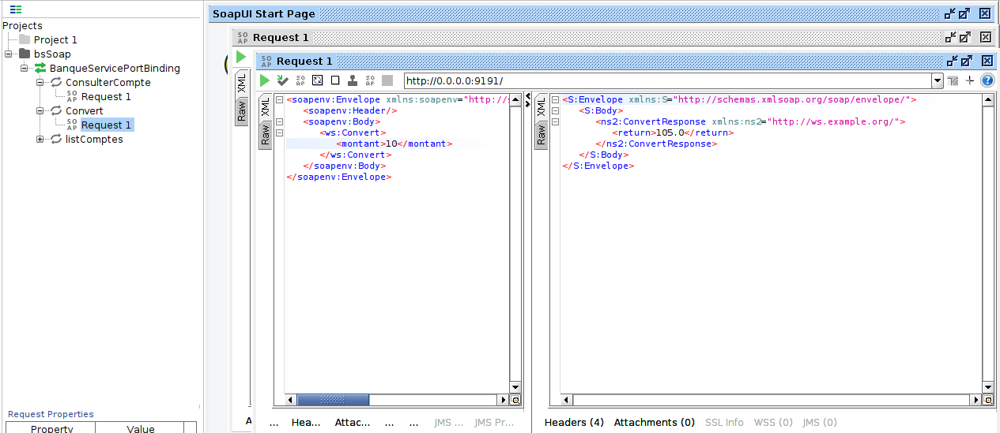

### **Web services SOAP with java , JAX-WS ,.Net and PHP**
notre projet consiste à créer un web service SOAP avec java , JAX-WS ,.Net et PHP


### **Prérequis**
- Java 8 ou supérieur
- xml,xsd 
- SoapUI
- .net
- PHP
### objectifs
- créer un web service SOAP avec java (SKELETON)
- consommer le web service SOAP avec java (client->STUB)
  - **Créer un Client SOAP Java** [Repo]( https://github.com/mohamedBoujdi/Client-Soap-Java.git) :link: (apres avoir génerer le proxy avec wsimport)
  
  - **resultat:**

    
- consommer le web service SOAP avec .net (client->STUB)
  - Créer un Client SOAP .Net
- consommer le web service SOAP avec PHP (client->STUB)
  - Créer un Client SOAP PHP

### **1- Création du web service SOAP avec java**

-**SOAP:** c'est un protocole de communication entre applications qui permet d'échanger des données entre des applications différentes.
il est basé sur le protocole HTTP et utilise le langage XML pour échanger des données.

**WSDL:** est un fichier XML qui décrit les services web et leurs méthodes.

**XSD:** est un fichier XML qui décrit les types de données utilisés dans les services web.
**requete SOAP:**
```xml
<soapenv:Envelope xmlns:soapenv="http://schemas.xmlsoap.org/soap/envelope/" xmlns:web="http://webservice.com/">
   <soapenv:Header/>
   <soapenv:Body>
      <web:hello>
         <arg0>?</arg0>
      </web:hello>
   </soapenv:Body>
</soapenv:Envelope>
```

**reponse SOAP:**

```xml
<soapenv:Envelope xmlns:soapenv="http://schemas.xmlsoap.org/soap/envelope/" xmlns:web="http://webservice.com/">
   <soapenv:Header/>
   <soapenv:Body>
      <web:helloResponse>
         <return>?</return>
      </web:helloResponse>
   </soapenv:Body>
</soapenv:Envelope>
```
 
- exemple d'un fichier wsdl : 
```xml
<?xml version="1.0" encoding="UTF-8"?>
<definitions name="HelloWorld" targetNamespace="http://www.example.org/HelloWorld/" xmlns="http://schemas.xmlsoap.org/wsdl/" xmlns:tns="http://www.example.org/HelloWorld/" xmlns:xsd="http://www.w3.org/2001/XMLSchema" xmlns:soap="http://schemas.xmlsoap.org/wsdl/soap/" xmlns:soap12="http://schemas.xmlsoap.org/wsdl/soap12/" xmlns:http="http://schemas.xmlsoap.org/wsdl/http/">
  <types>
    <xsd:schema targetNamespace="http://www.example.org/HelloWorld/">
      <xsd:element name="sayHello">
        <xsd:complexType>
          <xsd:sequence>
            <xsd:element name="arg0" type="xsd:string"/>
          </xsd:sequence>
        </xsd:complexType>
      </xsd:element>
      <xsd:element name="sayHelloResponse">
        <xsd:complexType>
          <xsd:sequence>
            <xsd:element name="return" type="xsd:string"/>
          </xsd:sequence>
        </xsd:complexType>
      </xsd:element>
    </xsd:schema>
  </types>
  <message name="sayHello">
    <part name="arg0" type="xsd:string"/>
  </message>
  <message name="sayHelloResponse">
    <part name="return" type="xsd:string"/>
  </message>
  <portType name="HelloWorld">
    <operation name="sayHello">
      <input message="tns:sayHello"/>
      <output message="tns:sayHelloResponse"/>
    </operation>
  </portType>
  <binding name="HelloWorldPortBinding" type="tns:HelloWorld">
    <soap:binding style="document" transport="http://schemas.xmlsoap.org/soap/http"/>
    <operation name="sayHello">
      <soap:operation soapAction=""/>
      <input>
        <soap:body use="literal"/>
      </input>
      <output>
        <soap:body use="literal"/>
      </output>
    </operation>
  </binding>
  <service name="HelloWorldService">
    <port name="HelloWorldPort" binding="tns:HelloWorldPortBinding">
      <soap:address location="http://localhost:8080/HelloWorld/HelloWorld"/>
    </port>
  </service>
</definitions>
```
source : https://www.tutorialspoint.com/wsdl/wsdl_quick_guide.htm

- exemple d'un fichier xsd : 

```xml
<?xml version="1.0" encoding="UTF-8"?>
<xs:schema xmlns:xs="http://www.w3.org/2001/XMLSchema" xmlns:tns="http://www.example.org/HelloWorld/" elementFormDefault="qualified" targetNamespace="http://www.example.org/HelloWorld/">
  <xs:element name="sayHello">
    <xs:complexType>
      <xs:sequence>
        <xs:element name="arg0" type="xs:string"/>
      </xs:sequence>
    </xs:complexType>
  </xs:element>
  <xs:element name="sayHelloResponse">
    <xs:complexType>
      <xs:sequence>
        <xs:element name="return" type="xs:string"/>
      </xs:sequence>
    </xs:complexType>
  </xs:element>
</xs:schema>
```

source : https://www.tutorialspoint.com/wsdl/wsdl_quick_guide.htm

les librairies qui interviennent dans la création du web service SOAP sont :
- **jaxb-api-2.3.0.jar**: c'est une librairie qui permet de générer des classes java à partir d'un fichier xsd.


- les deux fichiers sont generés automatiquement par la **librairie JAX-WS**.
est une API Java qui permet de créer des services web SOAP.

cette librairie est incluse dans le JDK 6 et supérieur mais pour le jdk 17 il faut l'ajouter manuellement.

cette librairie nous permet d'ajouter des annotations sur les classes et les méthodes pour générer automatiquement les fichiers wsdl et xsd.

- **@WebService(name = "WSName", targetNamespace = "http://www*boujdi.ma/WSName/")** : cette annotation permet de définir le nom du service web et son namespace.

   comme par exemple :
   
    ```java
    @WebService(serviceName = "BanqueWS")
    public class BanqueService {
        @WebMethod
        public double conversionEuroToDh(double montant) {
            return montant * 10.5;
        }
        
        //...
    }
    ```
- **@WebMethod(operationName = "operationName")** : cette annotation permet de définir le nom de l'opération.
- **@WebParam(name = "paramName")** : cette annotation permet de définir le nom du paramètre.
- **@WebResult(name = "resultName")** : cette annotation permet de définir le nom du résultat.
- **@WebFault(name = "faultName")** : cette annotation permet de définir le nom de l'exception.
     exemple :
    ```java
    @WebService(name = "WSName", targetNamespace = "http://www.boujdi.ma/WSName/")
    public class WSName {
        @WebMethod(operationName = "operationName")
        public @WebResult(name = "resultName") String operationName(@WebParam(name = "paramName") String paramName) {
            return "result";
        }
    }
    ```

- **@WebParam.Mode** : cette annotation permet de définir le mode du paramètre (IN, OUT, INOUT).
    - **IN** : le paramètre est en entrée.
    - **OUT** : le paramètre est en sortie.
    - **INOUT** : le paramètre est en entrée et en sortie.
    exemple : 
    ```java
    @WebMethod(operationName = "greeting")
    @WebResult(name = "return")
    public String greeting(@WebParam(name = "arg0") String arg0, 
  @WebParam(name = "arg1", mode = WebParam.Mode.OUT) Holder<String> arg1) 
  {
        arg1.value = "Hello " + arg0;
        return "Hello " + arg0;
  }
    ```
- **@WebParam.Header** : cette annotation permet de définir si le paramètre est un header.
- **@WebParam.PartName** : cette annotation permet de définir le nom de la partie du paramètre.


 

source mon repo github : [BanqueService](https://github.com/mohamedBoujdi/webService-soap-wsdl/blob/main/src/main/java/org/example/ws/BanqueService.java)


avec cette endpoint http://0.0.0.0:9191/?wsdl voir le fichier wsdl généré automatiquement.

avec cette endpoint http://0.0.0.0:9191/?xsd=1 voir le fichier xsd généré automatiquement.


## 2.2. Déploiement du service web

pour déployer un service web SOAP il faut utiliser un serveur d'application qui supporte les services web SOAP. 
dans notre cas on va utiliser on crée un serveur ServerJAXWS qui héberge notre service web.
 ```java
public class ServerJAXWS {
    public static void main(String[] args) {
        Endpoint.publish("http://0.0.0.0:9191/", new BanqueService());
        System.out.println("Server started and listening on port 9191");
    }
}
```

## 2.3. Consommation du service web

pour consommer un service web SOAP il faut utiliser un client SOAP comme par exemple SOAPUI ou Postman.

dans cette réquette j'ai envoyé un message avec le paramètre "2"(code de compte) et j'ai reçu le résultat "15073.203748906064".
  ```xml
<soapenv:Envelope xmlns:soapenv="http://schemas.xmlsoap.org/soap/envelope/" xmlns:ws="http://ws.example.org/">
    <soapenv:Header/>
    <soapenv:Body>
        <ws:ConsulterCompte>
            <code>2</code>
        </ws:ConsulterCompte>
    </soapenv:Body>
</soapenv:Envelope>
```
repense :
```xml
<S:Envelope xmlns:S="http://schemas.xmlsoap.org/soap/envelope/">
    <S:Body>
        <ns2:ConsulterCompteResponse xmlns:ns2="http://ws.example.org/">
            <return>
                <code>2</code>
                <solde>5073.203748906064</solde>
            </return>
        </ns2:ConsulterCompteResponse>
    </S:Body>
</S:Envelope>
```
comme dans l'image ci-dessous.

convertir le montant de dh en euro.
10 euro = 105.5 dh.

pour lister tous les comptes.
req:
```xml
<soapenv:Envelope xmlns:soapenv="http://schemas.xmlsoap.org/soap/envelope/" xmlns:ws="http://ws.example.org/">
   <soapenv:Header/>
   <soapenv:Body>
      <ws:listComptes/>
   </soapenv:Body>
</soapenv:Envelope>
```
resp:
```xml
<S:Envelope xmlns:S="http://schemas.xmlsoap.org/soap/envelope/">
   <S:Body>
      <ns2:listComptesResponse xmlns:ns2="http://ws.example.org/">
         <return>
            <code>1</code>
            <solde>7401.19495370108</solde>
         </return>
         <return>
            <code>2</code>
            <solde>2958.766330628888</solde>
         </return>
         <return>
            <code>3</code>
            <solde>4546.205624719651</solde>
         </return>
      </ns2:listComptesResponse>
   </S:Body>
</S:Envelope>
```


